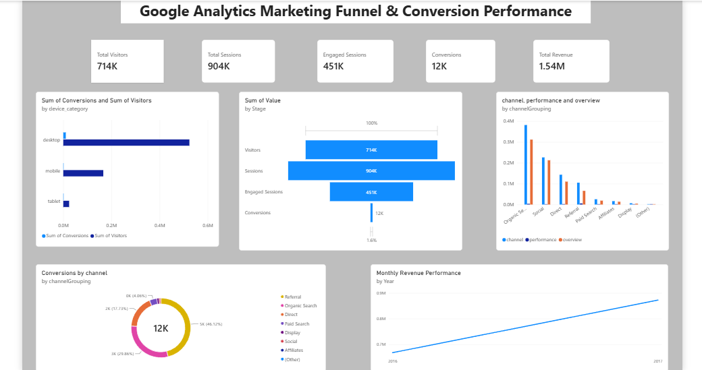

# FUTURE_DS_03

## Google Analytics Marketing Funnel & Conversion Performance Dashboard

A data analytics project focused on analyzing Google Analytics marketing funnel performance, user engagement, conversions, revenue, channels, and devices using **Python and Power BI**.

---

## 📌 Project Overview

This project analyzes Google Analytics data to understand how users move through the marketing funnel and identify key factors affecting engagement, conversions, and revenue.

The project includes data preparation and analysis using Python, followed by an interactive Power BI dashboard for business insights and performance monitoring.

---

## 🛠️ Tools & Technologies

- Python
- Pandas
- Jupyter Notebook
- Power BI
- CSV
- Data Visualization
- Exploratory Data Analysis (EDA)

---

## 📊 Key Performance Indicators

| KPI | Value |
|---|---:|
| Total Visitors | 714,167 |
| Total Sessions | 903,653 |
| Engaged Sessions | 451,031 |
| Conversions | 11,515 |
| Total Revenue | 1,540,071.24 |
| Engagement Rate | 49.91% |
| Conversion Rate | 1.27% |
| Engaged Conversion Rate | 2.55% |
| Revenue per Visitor | 2.16 |

---

## 📈 Dashboard

The Power BI dashboard provides an overview of:

- Marketing funnel performance
- Visitor and session analysis
- Engaged sessions
- Conversion performance
- Channel performance
- Device performance
- Revenue trends
- Conversions by channel
- Monthly revenue performance

### Dashboard Preview

---

## 🔍 Analysis Performed

### Marketing Funnel

The funnel tracks users through different stages:

**Visitors → Sessions → Engaged Sessions → Conversions**

This helps identify where users are being lost throughout the marketing journey.

### Channel Performance

Channel-level performance is analyzed to compare:

- Visitors
- Sessions
- Engagement
- Conversions
- Revenue

### Device Performance

Device-level analysis helps compare user activity and conversion performance across different devices.

### Revenue Analysis

Monthly and channel-based revenue performance is visualized to identify revenue trends and high-performing areas.

---

## 📂 Project Files

| File | Description |
|---|---|
| `Google Analytics Marketing Funnel & Conversion Performance.ipynb` | Python analysis and data preparation |
| `FUTURE_DS_03.pbix` | Power BI dashboard |
| `DASHBOARD.png` | Dashboard preview |
| `channel_performance.csv` | Channel-level performance data |
| `device_performance.csv` | Device-level performance data |
| `kpi_summary.csv` | KPI summary |
| `kpi_summary_clean.csv` | Clean KPI summary |

> Note: The original `ga_funnel_analysis.csv` dataset is larger than GitHub's standard web upload limit and is therefore not included in this repository.

---

## 💡 Key Insights

- The analysis recorded approximately **714K visitors** and **904K sessions**.
- Approximately **451K sessions were engaged**, resulting in an engagement rate of about **49.91%**.
- The dataset recorded **11.5K conversions**.
- The overall conversion rate was approximately **1.27%**.
- Total revenue generated was approximately **1.54M**.
- The funnel shows a significant reduction from sessions to engaged sessions and then to conversions, highlighting opportunities for improving user engagement and conversion optimization.
- Channel and device performance analysis can help identify areas for better marketing allocation and optimization.

---

## 🎯 Business Objective

The primary objective of this project is to transform raw Google Analytics data into meaningful business insights that can support:

- Marketing optimization
- Conversion rate improvement
- Customer engagement analysis
- Revenue growth
- Channel performance evaluation
- Device-level optimization
- Data-driven decision making

---

## 👨‍💻 Project

**Future Interns – Data Science & Analytics Internship**

**Project:** Google Analytics Marketing Funnel & Conversion Performance

**Tools:** Python | Pandas | Jupyter Notebook | Power BI
